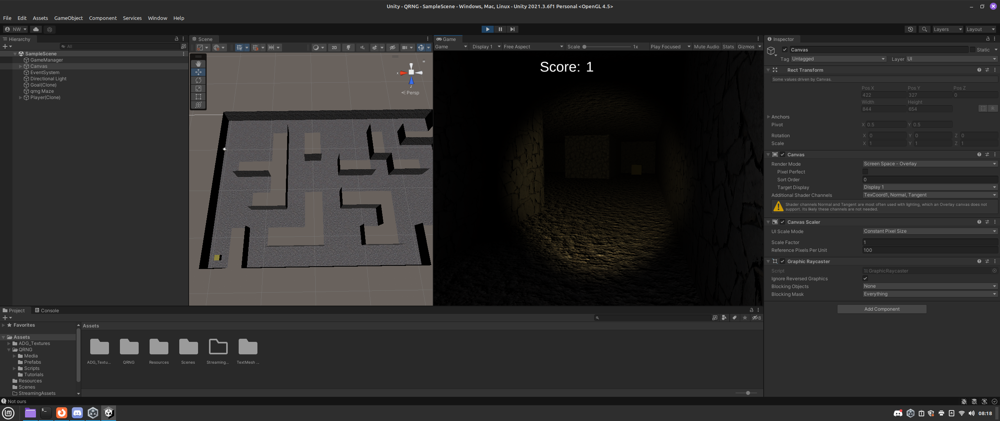

# Quantum Maze Generator

This is a Unity3D demo game that generates mazes using quantum randomness.  
The randomness comes from a custom Arduino-based QRNG (Quantum Random Number Generator) board built by Spooky Manufacturing, LLC.  

If no QRNG is detected on the serial port, the game gracefully falls back to Unity’s built-in PRNG.

---

## ✨ Features
- PBS-tuned path QRNG with dead-time management  
- Unity integration via `System.IO.Ports`  
- Procedurally generated mazes driven by live quantum entropy  
- Fallback to PRNG when hardware is not connected  
- Clean licensing separation (MIT for base generator, GPLv3 for QRNG modifications)

---

## 🛠 Requirements
- **Unity** 2020.3 or later (API Compatibility set to `.NET Standard`)  
- **Arduino UNO/Nano** (or compatible) running the QRNG firmware  
- QRNGv1 Hat board (or direct wiring with photodetectors/laser setup)  

---

## ▶️ How to Run
1. Clone this repo into a Unity project.  
2. Connect your QRNGv1 Arduino board via USB.  
3. In the Unity Editor:  
   - Open the **SampleScene**.  
   - Select the `QRNG` component and set the correct COM port (e.g. `COM3` or `/dev/ttyUSB0`).  
   - Press Play.  

If no board is found, the maze will still generate using pseudo-randomness.

---

## 🧩 Gameplay
- A new maze is generated each run.  
- Start and goal objects are placed automatically.  
- Maze topology is directly influenced by the entropy source (quantum vs. pseudo).  
- For debugging, you can toggle **Show Randomness** in the `QRNG` inspector to view raw data.

---

## 📜 Licensing
- Maze generation code by **Joseph Hocking (2017)**, licensed under **MIT**.  
- QRNG integration and modifications by **Noah G. Wood (2022)**, released under **GPLv3**.  
- See individual source files for details.  

---

## 📸 Screenshots

---

## 🚀 Future Ideas
- Cleaner randomness extractor (Von Neumann / hashing)  
- Background thread for serial I/O to avoid frame stalls  
- Replay mode using logged quantum bits  
- Alternative lattice mazes (hex, triangular)  

---

## 🙌 Acknowledgments
- [Joseph Hocking](https://github.com/jhocking) for the original Unity maze tutorial code.  
- All the folks experimenting with quantum randomness and indie game dev!  

---
